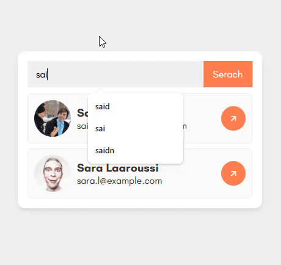

# 🔍 Live Search User Filter

A simple and responsive JavaScript app that filters a list of users in real-time based on input. As you type, the matching users are displayed instantly. Great for practicing DOM manipulation, array methods, and event handling.

---

## 🚀 Features

- 🔎 Real-time filtering as you type
- 👤 Displays name, email, location, and profile picture
- 🧠 Case-insensitive search
- 💡 Handles empty search results
- 📁 Data loaded from local JSON file

---

## 📸 Demo

 <!-- (You can record a short GIF of your app and upload it here) -->

---

## 🛠️ Technologies Used

- HTML5
- CSS3
- JavaScript (ES6+)
- JSON (mock user data)

---

## 📂 Folder Structure

